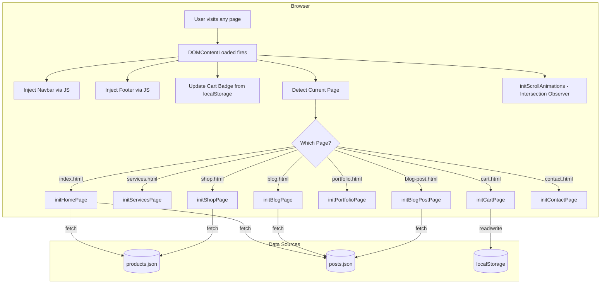
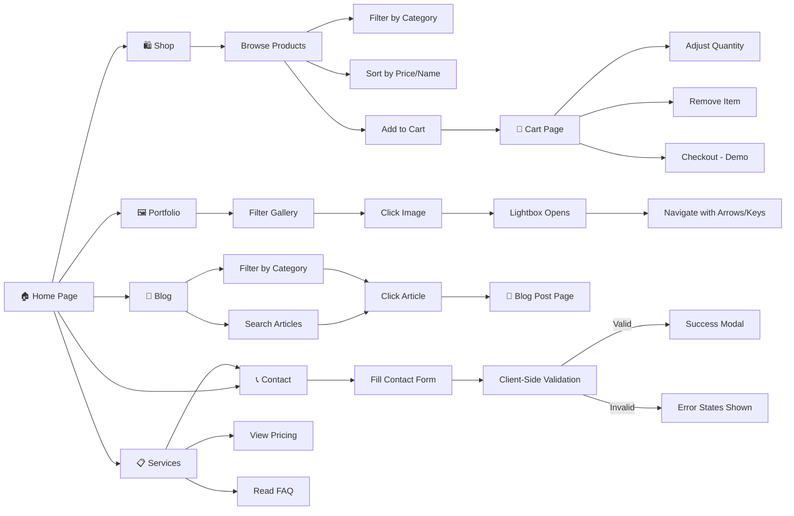
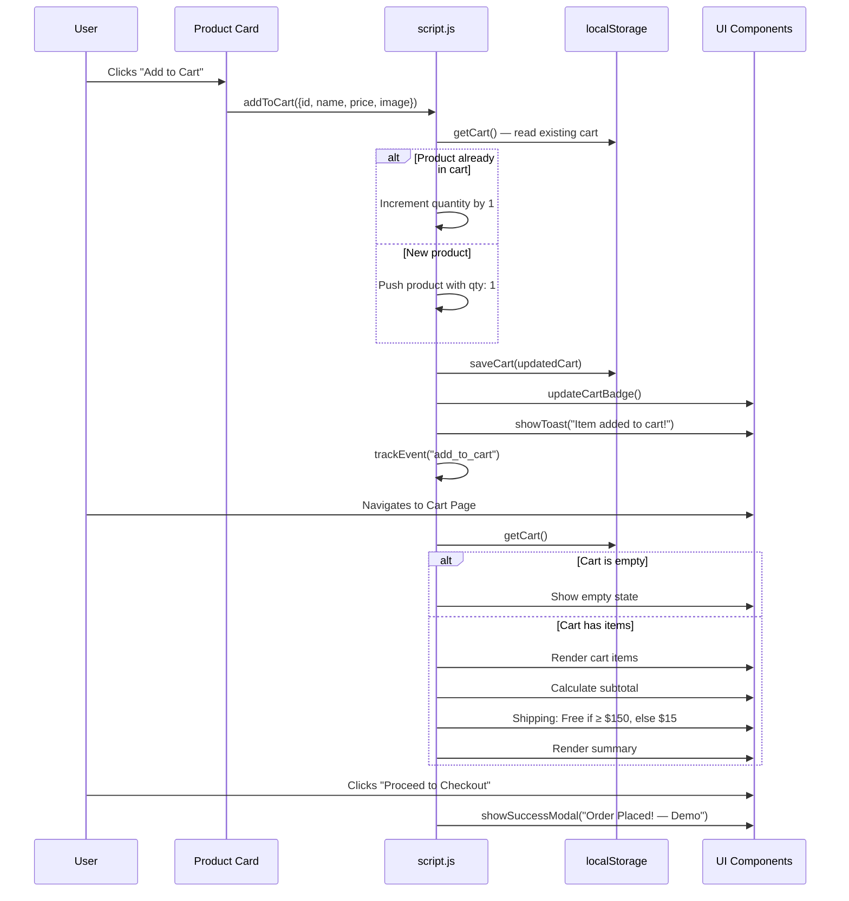
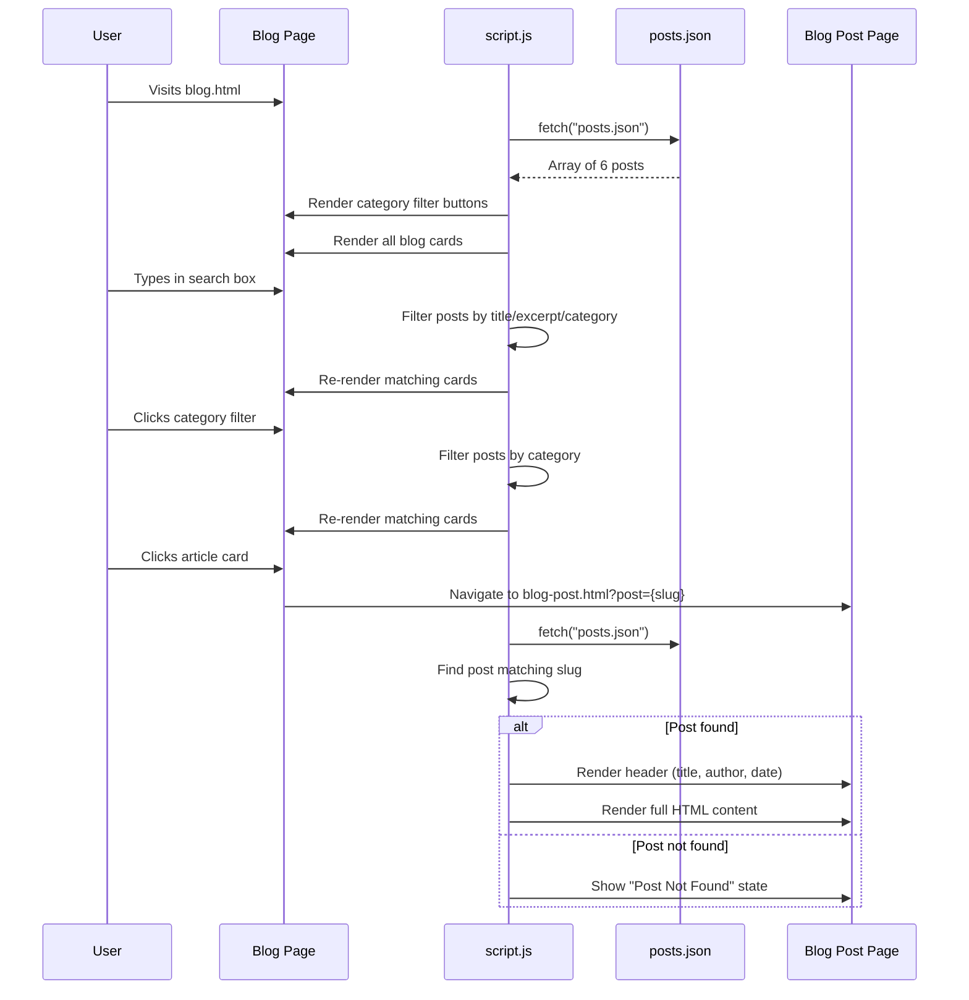
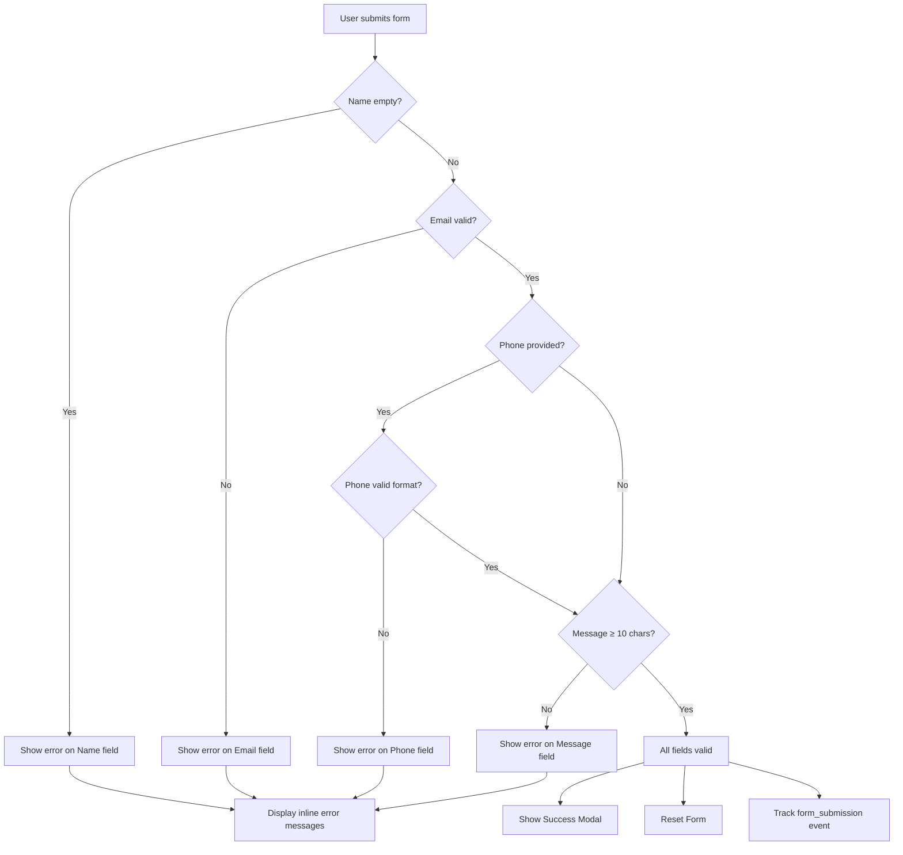

# 🏡 BrightNest Interiors — Interior Design Studio Website

> A fully responsive, multi-page interior design studio website built with **vanilla HTML5, CSS3, and JavaScript** — no frameworks, no build tools, no dependencies.


---

## 📌 Table of Contents

- [Overview](#-overview)
- [Live Pages](#-live-pages)
- [Features](#-features)
- [Tech Stack](#-tech-stack)
- [Project Architecture](#-project-architecture)
- [File Structure](#-file-structure)
- [System Flow Diagram](#-system-flow-diagram)
- [User Flow Diagram](#-user-flow-diagram)
- [Component Architecture](#-component-architecture)
- [Data Flow](#-data-flow)
- [Page Breakdown](#-page-breakdown)
- [Design System](#-design-system)
- [Shopping Cart Workflow](#-shopping-cart-workflow)
- [Blog System Workflow](#-blog-system-workflow)
- [Form Validation Workflow](#-form-validation-workflow)
- [Analytics & Tracking](#-analytics--tracking)
- [SEO Implementation](#-seo-implementation)
- [Responsive Breakpoints](#-responsive-breakpoints)
- [Performance Optimizations](#-performance-optimizations)
- [How to Run](#-how-to-run)
- [Screenshots](#-screenshots)
- [Future Enhancements](#-future-enhancements)
- [Author](#-author)

---

## 📖 Overview

**BrightNest Interiors** is a fictional award-winning interior design studio based in New York City. This project is a complete, production-quality static website that demonstrates:

- Multi-page website architecture with shared components
- Dynamic content rendering from JSON data files
- Client-side shopping cart with localStorage persistence
- Custom lightbox gallery for portfolio images
- FAQ accordion with smooth animations
- Client-side form validation
- Simulated analytics event tracking
- Scroll-triggered CSS animations
- Mobile-first responsive design

The website serves as a full-fledged digital presence for an interior design business — showcasing services, a curated product shop, a portfolio gallery, a design blog, and a contact form.

---

## 🌐 Live Pages

| Page | File | Description |
|------|------|-------------|
| **Home** | `index.html` | Hero banner, service overview, featured products, testimonials, blog teaser, CTA |
| **Services** | `services.html` | Detailed service descriptions, pricing cards, FAQ accordion |
| **Shop** | `shop.html` | Product grid with category filters and sorting |
| **Cart** | `cart.html` | Shopping cart with quantity controls, subtotal, shipping, checkout |
| **Portfolio** | `portfolio.html` | Filterable image gallery with custom lightbox |
| **Blog** | `blog.html` | Blog listing with search and category filters |
| **Blog Post** | `blog-post.html` | Dynamic single post page (query-string routing) |
| **Contact** | `contact.html` | Validated contact form, studio info, newsletter signup |

---

## ✨ Features

### Core Features
- 🏠 **8-page responsive website** — fully functional without a backend
- 🛒 **Shopping cart** — add/remove items, adjust quantities, persisted via `localStorage`
- 🖼️ **Custom lightbox** — keyboard-navigable image viewer with prev/next controls
- 📝 **Blog system** — JSON-powered articles with category filtering and search
- 🔍 **Product filtering & sorting** — filter by category, sort by price or name
- 📱 **Mobile-first design** — responsive across all breakpoints (480px / 768px / 1024px)

### UX Features
- ✅ Client-side **form validation** with real-time error states
- 🎯 Scroll-triggered **fade-in animations** via Intersection Observer
- 💬 **Toast notifications** for cart actions and form submissions
- 🎠 **Testimonial slider** with auto-play and manual controls
- 📋 **FAQ accordion** with smooth expand/collapse transitions
- 🧭 **Sticky glassmorphic navbar** with scroll shadow effect
- 🍔 **Hamburger menu** for mobile navigation

### Technical Features
- 📊 Simulated **analytics events** (GTM-compatible `dataLayer` pushes)
- 🔗 **Shared navbar and footer** injected via JavaScript (DRY principle)
- 📄 **SEO-optimized** — proper meta tags, semantic HTML, heading hierarchy
- ♿ **Accessible** — ARIA labels, keyboard navigation, screen reader friendly

---

## 🛠 Tech Stack

| Technology | Purpose | Why This Choice |
|------------|---------|-----------------|
| **HTML5** | Page structure & semantic markup | Native browser support, SEO-friendly semantic elements, zero dependencies |
| **CSS3** | Styling & layout | Custom properties (variables) for design tokens, CSS Grid & Flexbox for layouts, no preprocessor needed |
| **Vanilla JavaScript** | Interactivity & logic | Full control over DOM, no framework overhead, demonstrates core JS proficiency |
| **JSON** | Data storage | Lightweight, easily editable product/blog data without a database |
| **localStorage** | Cart persistence | Built-in browser API, no server required for cart state |
| **Google Fonts** | Typography | Playfair Display (headings) + Inter (body) for a premium typographic pairing |
| **Intersection Observer API** | Scroll animations | Performance-efficient alternative to scroll event listeners |
| **CSS Custom Properties** | Design system tokens | Centralized theming — change one variable, update across the entire site |

### Why No Frameworks?

This project intentionally avoids React, Vue, Tailwind, Bootstrap, etc. to demonstrate:
1. **Deep understanding** of fundamental web technologies
2. **Performance** — zero JavaScript bundle overhead, no tree shaking needed
3. **Full control** — every CSS rule and DOM interaction is purpose-built
4. **Simplicity** — open `index.html` in a browser, and it works

---

## 🏗 Project Architecture

```
┌──────────────────────────────────────────────────────────┐
│                    PRESENTATION LAYER                     │
│                                                          │
│  index.html  │  services.html  │  shop.html  │  cart.html│
│  portfolio.html  │  blog.html  │  blog-post.html         │
│  contact.html                                            │
├──────────────────────────────────────────────────────────┤
│                     STYLING LAYER                         │
│                                                          │
│  styles.css                                              │
│  ├── CSS Custom Properties (Design Tokens)               │
│  ├── Reset & Base Styles                                 │
│  ├── Component Styles (navbar, cards, buttons, etc.)     │
│  ├── Page-Specific Styles                                │
│  ├── Responsive Breakpoints (480 / 768 / 1024px)         │
│  └── Animation Keyframes                                 │
├──────────────────────────────────────────────────────────┤
│                     LOGIC LAYER                           │
│                                                          │
│  script.js                                               │
│  ├── Shared Components (navbar, footer injection)        │
│  ├── Cart System (localStorage CRUD)                     │
│  ├── Page Initializers (per-page logic)                  │
│  ├── UI Components (toast, modal, lightbox, slider)      │
│  ├── Data Fetching (JSON fetch helper)                   │
│  └── Analytics (dataLayer event tracking)                │
├──────────────────────────────────────────────────────────┤
│                      DATA LAYER                           │
│                                                          │
│  products.json  ─── 8 products (id, name, price, etc.)   │
│  posts.json     ─── 6 blog posts (full content, meta)    │
├──────────────────────────────────────────────────────────┤
│                     ASSETS LAYER                          │
│                                                          │
│  images/                                                 │
│  ├── hero-banner.png                                     │
│  ├── service-*.png (3 service images)                    │
│  ├── product-*.png (8 product images)                    │
│  ├── portfolio-*.png (6 portfolio images)                │
│  └── blog-*.png (6 blog thumbnails)                      │
└──────────────────────────────────────────────────────────┘
```

---

## 📁 File Structure

```
interior-design-website/
│
├── index.html              # Home page — hero, services, products, testimonials, blog teaser
├── services.html           # Services page — detailed descriptions, pricing, FAQ
├── shop.html               # Shop page — product grid with filters & sorting
├── cart.html                # Cart page — cart items, quantity controls, checkout
├── portfolio.html          # Portfolio page — filterable gallery with lightbox
├── blog.html               # Blog listing — search, category filters, article cards
├── blog-post.html          # Single blog post — dynamic content via query string
├── contact.html            # Contact page — validated form, studio info, newsletter
│
├── styles.css              # Global stylesheet (1,728 lines) — full design system
├── script.js               # Global JavaScript (966 lines) — all interactivity
│
├── products.json           # Product catalog data (8 items)
├── posts.json              # Blog post data with full HTML content (6 articles)
│
├── images/                 # All image assets (24 files)
│   ├── hero-banner.png
│   ├── service-residential.png
│   ├── service-commercial.png
│   ├── service-consultation.png
│   ├── product-armchair.png
│   ├── product-lamp.png
│   ├── product-vase.png
│   ├── product-mirror.png
│   ├── product-cushion.png
│   ├── product-shelf.png
│   ├── product-rug.png
│   ├── product-candle.png
│   ├── portfolio-modern-living.png
│   ├── portfolio-luxury-kitchen.png
│   ├── portfolio-serene-bedroom.png
│   ├── portfolio-home-office.png
│   ├── portfolio-spa-bathroom.png
│   ├── portfolio-elegant-dining.png
│   ├── blog-color-psychology.png
│   ├── blog-small-spaces.png
│   ├── blog-sustainable-design.png
│   ├── blog-kitchen-trends.png
│   ├── blog-lighting-guide.png
│   └── blog-bedroom-retreat.png
│
└── README.md               # This file
```

---

## 🔄 System Flow Diagram



---

## 👤 User Flow Diagram



---

## 🧩 Component Architecture

```mermaid
graph TD
    subgraph Shared Components
        NAV[Navbar - getNavbar]
        FOOT[Footer - getFooter]
        TOAST[Toast Notification - showToast]
        MODAL[Success Modal - showSuccessModal]
        BADGE[Cart Badge - updateCartBadge]
    end
    
    subgraph Page Components
        HERO[Hero Section]
        SCARD[Service Cards]
        PCARD[Product Cards - productCardHTML]
        BCARD[Blog Cards - blogCardHTML]
        SLIDER[Testimonials Slider]
        GALLERY[Portfolio Gallery]
        LIGHTBOX[Custom Lightbox]
        FAQ[FAQ Accordion]
        PRICING[Pricing Cards]
        FORM[Contact Form]
        CART[Cart Item Cards]
    end
    
    subgraph Data Handlers
        FETCH[fetchJSON Helper]
        CARTOPS[Cart CRUD - getCart/saveCart/addToCart]
        FILTER[Category Filters]
        SORT[Sort Controls]
        SEARCH[Blog Search]
        VALIDATE[Form Validator]
    end
    
    NAV --> BADGE
    PCARD --> CARTOPS
    CARTOPS --> TOAST
    FORM --> VALIDATE
    VALIDATE --> MODAL
    GALLERY --> LIGHTBOX
```



---

## 📊 Data Flow

### Product Data Flow
```
products.json ──fetch──► JavaScript ──render──► Product Cards (HTML)
                                         │
                                    Filter/Sort
                                         │
                              ──► Re-render Grid
```

### Cart Data Flow
```
"Add to Cart" click
      │
      ▼
  Read localStorage ──► Parse JSON ──► Find/Add item
      │
      ▼
  Save to localStorage ──► Update Badge ──► Show Toast
      │
      ▼
  Cart Page: Read localStorage ──► Render Cart Items
      │                                    │
      ▼                                    ▼
  +/- Quantity ──► Update localStorage    Remove ──► Filter & Save
      │
      ▼
  Calculate Subtotal + Shipping ──► Render Summary
```

### Blog Data Flow
```
posts.json ──fetch──► JavaScript
      │
      ├──► Blog Page: Render all cards with filters/search
      │
      ├──► Home Page: Render latest 3 posts as teaser
      │
      └──► Blog Post Page: Match slug from ?post=query-param
                │
                ▼
          Render full article content
```

---

## 📄 Page Breakdown

### 1. Home Page (`index.html`)
| Section | Description |
|---------|-------------|
| **Hero** | Full-viewport banner with gradient overlay, heading, CTA buttons |
| **Services Overview** | 4 service cards (Residential, Commercial, Consultation, Project Management) |
| **Featured Products** | Dynamically loaded from `products.json` (filtered by `featured: true`) |
| **Stats Bar** | 250+ Projects, 8 Years, 98% Satisfaction, 12 Awards |
| **Testimonials** | Auto-playing slider with 3 client quotes, prev/next controls, dot navigation |
| **Blog Teaser** | Latest 3 blog posts from `posts.json` |
| **CTA** | "Ready to Transform Your Space?" call-to-action section |

### 2. Services Page (`services.html`)
| Section | Description |
|---------|-------------|
| **Service Details** | 3 alternating-layout sections with images: Residential, Commercial, Consultation |
| **Pricing Cards** | 3-tier pricing (Consultation $350, Full Room $2,500, Full Home $12,000) |
| **FAQ Accordion** | 5 expandable questions with smooth max-height transitions |
| **CTA** | "Let's Create Something Beautiful" call-to-action |

### 3. Shop Page (`shop.html`)
| Section | Description |
|---------|-------------|
| **Filter Bar** | Category filter buttons (All, Furniture, Lighting, Decor, Textiles) + sort dropdown |
| **Product Grid** | Responsive grid of product cards with images, prices, "Add to Cart" buttons |
| **Shipping Info** | Free shipping over $150, quality guarantee, design support |

### 4. Cart Page (`cart.html`)
| Section | Description |
|---------|-------------|
| **Empty State** | Shown when cart is empty — icon, message, "Continue Shopping" button |
| **Cart Items** | Product image, name, price, quantity controls (−/+), remove button |
| **Cart Summary** | Subtotal, shipping calculation, total, "Proceed to Checkout" button |

### 5. Portfolio Page (`portfolio.html`)
| Section | Description |
|---------|-------------|
| **Filter Bar** | Category filters (All, Residential, Kitchen, Commercial) |
| **Gallery Grid** | 6 project images with hover overlay (title + category) |
| **Lightbox** | Full-screen image viewer with close, prev, next + keyboard navigation |
| **CTA** | "Love What You See?" call-to-action |

### 6. Blog Page (`blog.html`)
| Section | Description |
|---------|-------------|
| **Search & Filters** | Text search input + category filter buttons (Design Tips, Small Spaces, etc.) |
| **Blog Grid** | Article cards with thumbnails, category badges, dates, excerpts |
| **Newsletter CTA** | Email subscription form |

### 7. Blog Post Page (`blog-post.html`)
| Section | Description |
|---------|-------------|
| **Post Header** | Category badge, date, author, post title (all dynamic) |
| **Post Body** | Full HTML article content rendered from JSON |
| **Not Found State** | Shown if slug doesn't match any post |
| **Back Link** | "Back to All Articles" navigation |

### 8. Contact Page (`contact.html`)
| Section | Description |
|---------|-------------|
| **Contact Form** | Name, email, phone, service dropdown, message — with validation |
| **Contact Info** | Studio address, phone, email, hours |
| **Newsletter** | Sidebar newsletter signup form |
| **Map Placeholder** | Studio location display (245 West 29th Street, Chelsea, NYC) |

---

## 🎨 Design System

### Color Palette

| Token | Hex | Usage |
|-------|-----|-------|
| `--clr-primary` | `#2c6e49` | Buttons, links, accents |
| `--clr-primary-dark` | `#1b4332` | Hover states, dark sections |
| `--clr-primary-light` | `#52b788` | Decorative accents |
| `--clr-accent` | `#c9a84c` | Gold highlights, CTAs |
| `--clr-accent-light` | `#e0c97f` | Hover states for accent |
| `--clr-bg` | `#faf8f5` | Page background |
| `--clr-bg-alt` | `#f0ece4` | Alternate section backgrounds |
| `--clr-surface` | `#ffffff` | Card backgrounds |
| `--clr-text` | `#2d2a27` | Primary text |
| `--clr-text-muted` | `#6b6560` | Secondary text |

### Typography

| Font | Usage | Source |
|------|-------|--------|
| **Playfair Display** | Headings (h1–h6) | Google Fonts |
| **Inter** | Body text, buttons, UI | Google Fonts |

### Spacing Scale

```
--sp-xs:  0.25rem  (4px)
--sp-sm:  0.5rem   (8px)
--sp-md:  1rem     (16px)
--sp-lg:  1.5rem   (24px)
--sp-xl:  2rem     (32px)
--sp-2xl: 3rem     (48px)
--sp-3xl: 4rem     (64px)
```

### Shadow System

```
--shadow-sm: Subtle — card rest state
--shadow-md: Medium — card hover state
--shadow-lg: Large  — elevated modals
--shadow-xl: Extra  — lightbox overlays
```

---

## 🛒 Shopping Cart Workflow



---

## 📝 Blog System Workflow



---

## ✅ Form Validation Workflow



**Validation Rules:**
| Field | Rule |
|-------|------|
| **Name** | Required — must not be empty |
| **Email** | Required — must match `user@domain.tld` regex pattern |
| **Phone** | Optional — if provided, must match `+digits-spaces-parens` (min 7 chars) |
| **Message** | Required — minimum 10 characters |

---

## 📊 Analytics & Tracking

The site implements a simulated analytics layer compatible with Google Tag Manager (GTM) / Google Analytics 4 (GA4):

```javascript
window.dataLayer = window.dataLayer || [];

function trackEvent(eventName, params) {
  window.dataLayer.push({ event: eventName, ...params });
}
```

### Tracked Events

| Event Name | Trigger | Parameters |
|------------|---------|------------|
| `add_to_cart` | Product added to cart | `item_id`, `item_name`, `price`, `currency` |
| `form_submission` | Contact form submitted | `form_name`, `form_location` |
| `newsletter_subscribe` | Newsletter signup | `email_source` (footer / contact_page / blog) |

In production, these events would be picked up by GTM container tags and forwarded to GA4, Meta Pixel, etc.

---

## 🔍 SEO Implementation

| Technique | Implementation |
|-----------|----------------|
| **Title Tags** | Unique, descriptive titles on every page (e.g., "Shop Curated Decor — BrightNest Interiors") |
| **Meta Descriptions** | Unique descriptions per page summarizing content |
| **Heading Hierarchy** | Single `<h1>` per page; logical `<h2>`–`<h4>` nesting |
| **Semantic HTML** | `<main>`, `<nav>`, `<section>`, `<footer>`, `<article>` elements |
| **Image Alt Text** | Descriptive alt attributes on all images |
| **ARIA Labels** | On buttons, inputs, navigation, and interactive elements |
| **Open Graph** | Extensible — meta tags can be added for social sharing |
| **Smooth Scroll** | `scroll-behavior: smooth` in CSS |

---

## 📱 Responsive Breakpoints

| Breakpoint | Target | Key Changes |
|------------|--------|-------------|
| **< 480px** | Small phones | Single-column layouts, stacked grids |
| **≥ 480px** | Large phones | 2-column product/blog grids |
| **≥ 768px** | Tablets | Desktop nav links visible, 3-column grids, side-by-side service layouts |
| **≥ 1024px** | Desktop | 4-column product grid, full nav, optimal content widths |

**Mobile Navigation:** The hamburger menu toggles a vertical dropdown nav panel. An animated 3-line → X transformation provides visual feedback.

---

## ⚡ Performance Optimizations

| Optimization | Description |
|-------------|-------------|
| **Lazy Loading** | All below-fold images use `loading="lazy"` |
| **Intersection Observer** | Scroll animations use IO instead of scroll listeners (no jank) |
| **CSS Custom Properties** | Single source of truth for theming — no redundant style declarations |
| **Minimal JS** | Single file, no dependencies, no transpilation needed |
| **No Framework Overhead** | Zero KB of framework code — pure vanilla JS |
| **Shared Components** | Navbar and footer injected once via JS — DRY, no copy-paste |
| **Efficient DOM Updates** | `innerHTML` batch rendering for product/blog grids |

---

## 🚀 How to Run

### Option 1: Direct Open (Simplest)
```bash
# Just double-click index.html in your file explorer
# Note: fetch() for JSON files requires a server (see Option 2)
```

### Option 2: Local Server (Recommended)
```bash
# Using Python
python -m http.server 8000

# Using Node.js
npx serve .

# Using VS Code
# Install "Live Server" extension → Right-click index.html → "Open with Live Server"
```

Then visit `http://localhost:8000` (or the port shown in terminal).

### Option 3: GitHub Pages
Push to GitHub → Go to Settings → Pages → Select `main` branch → Save.
Your site will be live at `https://your-username.github.io/interior-design-website/`.

---

## 🖼 Screenshots

### Home Page
- Full-viewport hero with gradient overlay
- Service cards with hover animations
- Product grid dynamically loaded from JSON
- Auto-playing testimonial slider

### Shop Page
- Category filter buttons (All / Furniture / Lighting / Decor / Textiles)
- Sort dropdown (Price Low→High, Price High→Low, Name A→Z)
- Product cards with image zoom on hover

### Portfolio Gallery
- Filterable image grid
- Custom lightbox with keyboard navigation (← → Esc)

### Contact Page
- Real-time form validation with inline error messages
- Studio info sidebar with address, phone, email, hours

---

## 🔮 Future Enhancements

- [ ] Dark mode toggle with CSS custom property switching
- [ ] Product detail pages with image galleries
- [ ] Wishlist functionality (localStorage)
- [ ] Blog comment system (static or 3rd-party like Disqus)
- [ ] Google Maps embed on contact page
- [ ] Progressive Web App (PWA) with service worker
- [ ] CMS integration (Netlify CMS / Contentful) for blog posts
- [ ] Email API integration for contact form (SendGrid / Formspree)
- [ ] Image optimization (WebP conversion, responsive `srcset`)
- [ ] Sitemap.xml and robots.txt generation

---

## 👨‍💻 Author

**Balaj** — Built as an internship project demonstrating full-stack frontend development capabilities with vanilla web technologies.

---

## 📜 License

This project is open source and available under the [MIT License](LICENSE).
